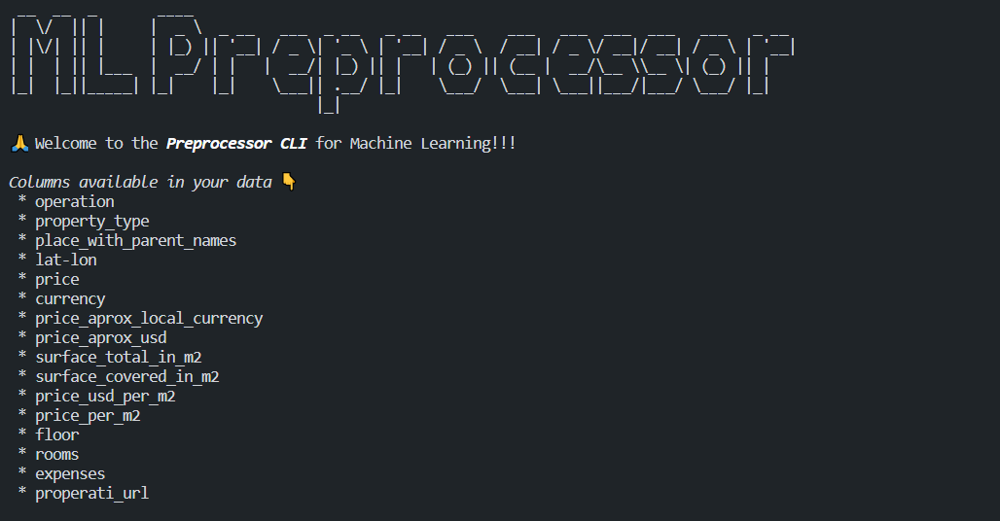
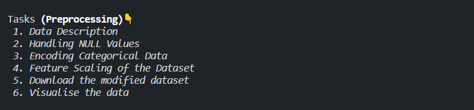
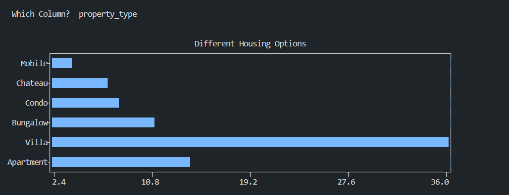

# ML Preprocessor Pipeline CLI

<!--The CLI made to preprocess the database and save your **time**:clock1:-->

## :thinking: Why?

Data preprocessing is a required first step before any machine learning machinery can be applied, because the algorithms learn from the data and the learning outcome for problem solving heavily depends on the proper data needed to solve a particular problem – which are called features.

## :page_facing_up: What?

- Given the database, the CLI provides various options to preprocess the data. 
- Options:
    - Data Description
    - Handling NULL Values
    - Encoding Categorical Data
    - Feature Scaling
    - Data Visualisation
- You can also **DOWNLOAD**:arrow_down: the modified dataset.

## :checkered_flag: Run

1. Clone this Repo: `git clone https://github.com/priyavratuniyal/ML_Preprocessor_Pipeline_CLI.git`
2. `cd ML_Preprocessor_Pipeline_CLI/`
3. `pip3 install -r requirements.txt`
4. Now run, `python3 main.py` [Dataset's Path]
 Example: `python3 main.py dataset.csv`
### Then you will see the below home screen. :tada:
 <b>Note</b>: You can run `python3 main.py sample_data.csv`, a sample data file is provided with this repo.

## :camera: Screenshots

    

    

    

<!-- Future Scope

- Implementing GUI of this project.
- Implement Undo and Redo for the Database.
- Implement other preprocessing steps.
-->
#### If you have any suggestions/questions, ping <i>[here.](mailto:uniyalpriyavrat1@gmail.com)</i>
